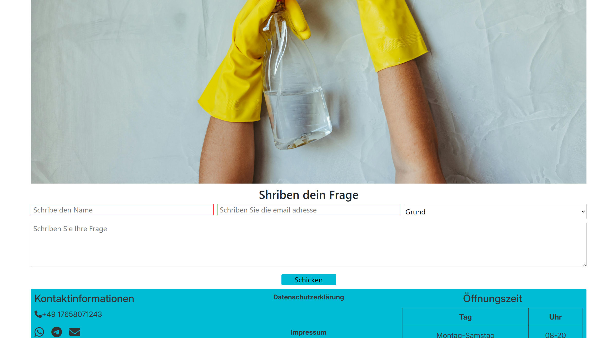

# Blitzsaubeer-Project-1
A responsive static website built for a fictional cleaning company called Blitzsaubeer. The website showcases services, builds trust with potential clients, and offers easy ways to contact the company. This is the first portfolio project for the Code Institute Full-Stack Developer Diploma.

## Table of Contents 

- [Overview]

- [Features]

- [UX Design]

- [Technologies Used]

- [Testing]

- [Deployment]

- [Credits]

## Overview
External User Goals:

Learn about cleaning services and pricing

Trust the company through clear visuals and testimonials

Easily contact the company or book a service

Site Owner Goals:

Attract clients and promote cleaning services

Present a professional brand identity

Gather client contact details for communication

## Features
- Header & Navigation
- Clear logo and name

- Responsive navbar with active link highlight

- Mobile menu toggle with hamburger icon

- Hero Section
- Engaging image/banner

- Brief introduction to the company’s values

- Services Section
- Grid layout showcasing offered services

- Responsive design with icons and hover effects

- Contact Form
- Users can submit inquiries via email and phone

- Form includes input validation with success checkmark icon

- Footer
- Social links (Font Awesome icons)

- Legal links to Privacy Policy and Impressum

# UX Design
- Wireframes
- Basic layout was planned for desktop and mobile.

- Design Choices
- Colors: Clean and calming tones (white/blue/green)

## Typography: Readable sans-serif fonts

- Icons: Font Awesome icons for clarity

## Accessibility
- All images use meaningful alt text

- Sufficient contrast for readability

- Form uses label linked with input via for and id

## Technologies Used
- HTML5

- CSS3

- Google Fonts

- Font Awesome

- Git and GitHub for version control

- Bootstrap 

## Testing
- HTML validated with W3C Validator

- CSS validated with Jigsaw Validator

- Manual testing done on:

- Chrome, Firefox, Edge

- Mobile (iOS/Android)

- Media queries tested at:

- 320px (small phones)

- 768px (tablets)

- 1024px+ (desktops)

## Known Bugs
- None at this time

## Deployment
- Project deployed on GitHub Pages

- Repository: GitHub - Blitzsaubeer

- To clone this repository:

- git clone https://github.com/Sori678/Blitzsaubeer-Project-1.git

## Credits
- Layout and responsiveness inspired by [Code Institute lessons]

- Icons: Font Awesome

- Images: Free commercial-use images from [Unsplash / Pexels]

## Screenshots

### Home Page 

### Services Page 

### About Page 

### FAQ page 

